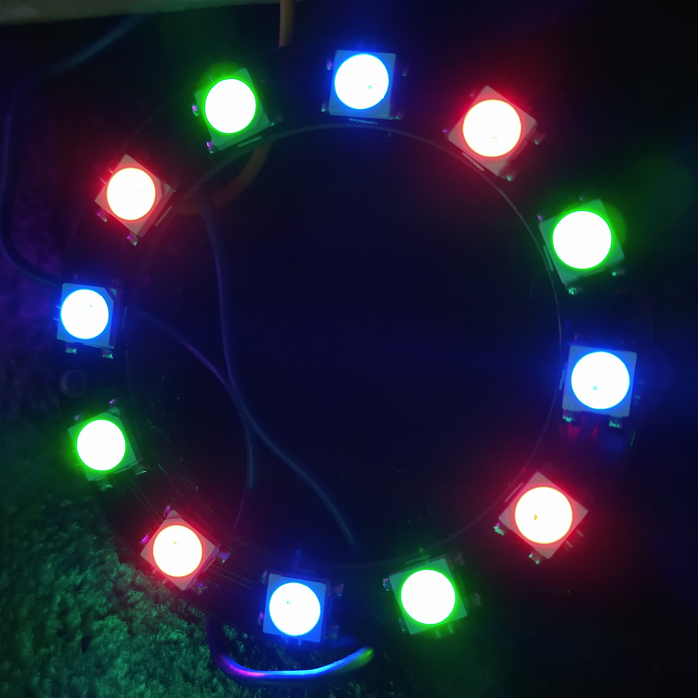

# WS2812-Controller
A library to control the WS2812-RGB led with an AVR-device

### How to use in Microchip Studio:
- Create a new C++ Executable project
- Select the chip you wanna use
- To add the library to your project, rightclick on your project in Solutionexplorer (Ctrl + Alt + L) -> Add -> Existing Item. Now locate the WS2812.h file on your pc.
   
- To test if it works, you can use following sample code:
```cpp
#define F_CPU 8000000
#include <avr/io.h>
#include <util/delay.h>

//define output pin and port
#define RGB_OutputPort PORTB
#define RGB_OutputPin PINB0
//includ the header
#include "WS2812.h"

int main(void)
{
	DDRB = 0b00000001; //Set PINB0 as output
	Strip strip = Strip(12); //Set the number of pixels
	strip.InitialiseStrip(); //Turn all leds off
	
	strip.SetPixelColor(0, 255,0,0); //Set the color of led one to red
	strip.SetPixelColor(1, 0,255,0); //Set the color of led two to green
	strip.SetPixelColor(2, 0,0,255); //Set the color of led three to blue
	strip.ShowPixel(); //Send the colors to the strip
}
```
#### After uploading to your AVR the first three leds should light up in red, green and blue.


## Functions: 
```cpp
LedIsOff(5) //returns whether led number 5 is on or off
ShowPixel() //Shows all previously set led's
SetPixelColor(2, 65280) //Set the color using a 32bit integer value
SetPixelColor(4, 255, 0, 0) //Set the color of the pixel 4 to red
SetPixelColor(3, 7, 0, 0, 255) //Set the color from pixel 3 to pixel 10 to blue.
SetPixelColor(1, 5, 16711680) // //Set the color from pixel 1 to pixel 6 red.
SetPixelColor(0, strip.ColorHSV(0, 255,255)); //Set the color using the HSV color wheel parameter:(1 = Color[0-360]; 2 = value of gray[0-255]; 3 = Brightness[0-255])
LedsOff() //Turn all leds off
SetMaxBrightness(150) //Sets the maximum Brightness of the strip to 150. From 0-255
InitialiseStrip() //Initialise the strip => Set all leds to off
GetLedCount() //Returns the number of leds you set on start | numberOfPixels does the same
Map(value, value_min, value_max, out_min, out_max) //Map a value from min max to min max
GetPixelColor(index) //returns a 32bit integer with the color
GetPixelRed(index) //returns an 8bit integer representing the brightness of red
GetPixelGreen(index) //returns an 8bit integer representing the brightness of green
GetPixelBlue(index) //returns an 8bit integer representing the brightness of blue
``` 
## This is how it could look like

